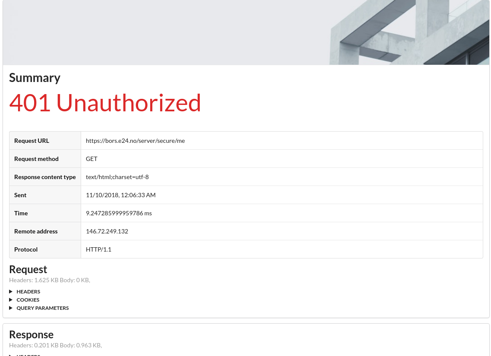
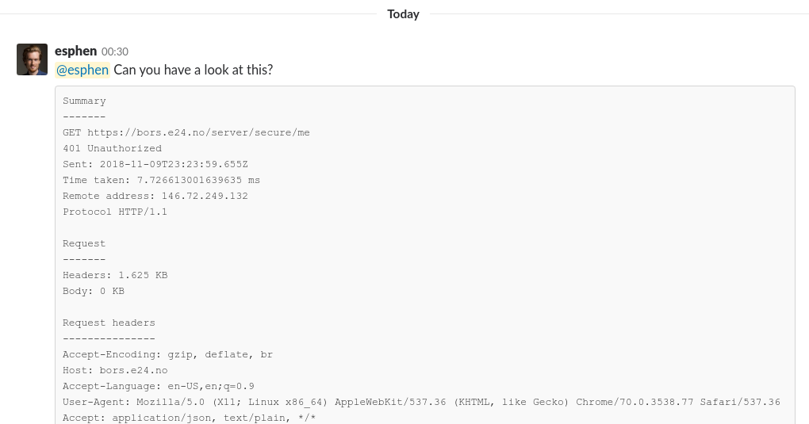
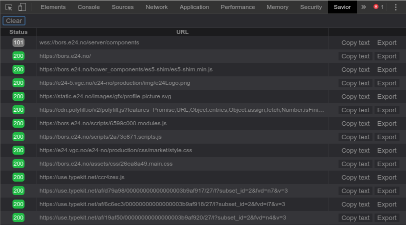

# Savior 

> Easily export single failed or successful requests and share with developers

**Download: [Chrome][play-store] | [Firefox][amo]**

If you've ever been in a situation where you have had to copy and paste URLs, headers or
status codes in order to describe an issue with a servlet, you know this is tedious and
error-prone. Often you forget important information, and the developer will have to contact
you to get the required fields to diagnose the issue. That is okay, we're all human! But
what if there was a better way?

Savior makes this an issue of the past by making it plain easy to generate a beautiful,
well organized HTML document that contains all the details of the request and response.
This document can be either sent to a developer or attached to an issue in an issue
tracker like Bugzilla or Jira.

Generating plain text is also supported, intended for use with chat platforms like Slack
and IRC.

The requests are presented via a panel that is added to the developer tools of your browser.

## A note on Firefox

There is currently an issue with Firefox that makes a lot of requests go missing from the
list in the devtools panel. This is an issue with the WebExtensions API in Firefox and
must be fixed before it will work properly. Follow [bug 1472653][bugzilla-bug] for more
information.

## Permissions

The following permissions are in use

|Permission    |Reason                                               |
|--------------|-----------------------------------------------------|
|downloads     |Downloading HTML files of requests to the computer   |
|clipboardWrite|Writing texts of requests to the computer's clipboard|

[play-store]: https://chrome.google.com/webstore/detail/savior/jmdpeobafnjdgdgbigijnnifnfhinhjj
[amo]: https://addons.mozilla.org/en-US/firefox/addon/savior-devtool
[bugzilla-bug]: https://bugzilla.mozilla.org/show_bug.cgi?id=1472653
